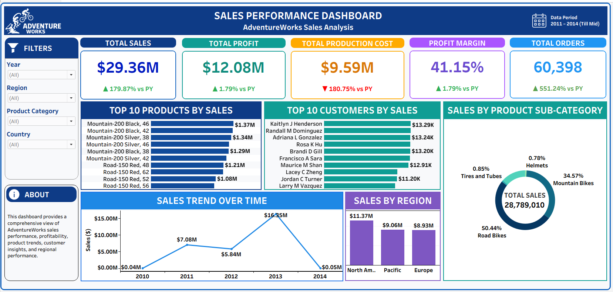
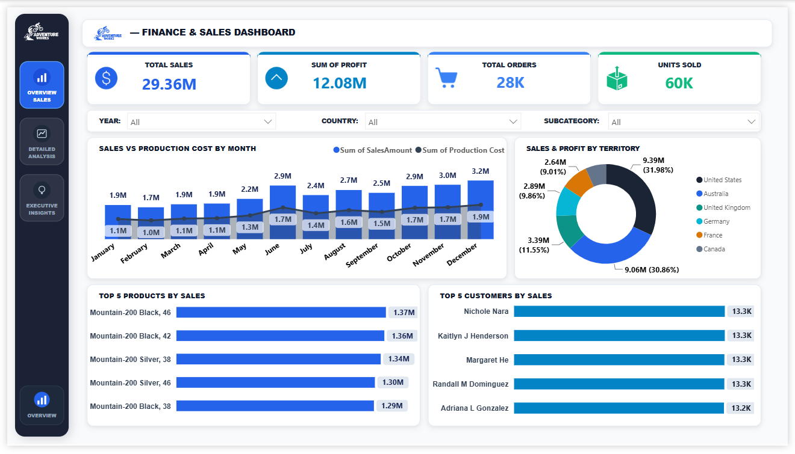
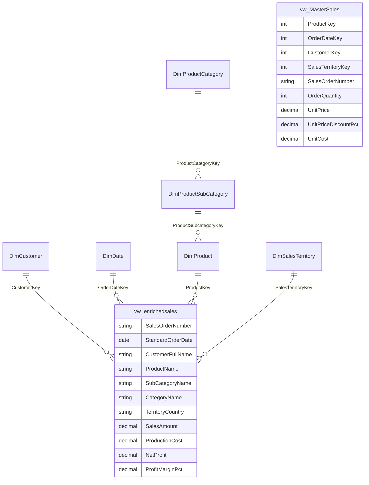

<div align="center">

# 🚴 AdventureWorks Enterprise SQL & Business Analytics
### **Relational Data Modeling • Advanced SQL Queries • Window Functions • Interactive KPI Dashboard**

[](powerbi/)
[](tableau/)
[](excel/)
[](sql/)
[](presentation/)
[](dashboard/index.html)

<br/>

*An enterprise relational data analytics project executing complex SQL queries, window ranking functions, and profit margin variance analysis across 60,398 sales transactions in the AdventureWorks ecosystem.*

</div>

---

## 🎯 Executive Summary & Business Objective

AdventureWorks is a multinational manufacturing company producing bicycles, components, and apparel. To support data-driven decision making, executive management required an end-to-end analytical audit of internet sales transactions.

### Key Objectives:
1. **Unify Fragmented Sales Records:** Merge historical and new sales transaction tables (`FactInternetSales` + `Fact_Internet_Sales_New`) into a consolidated analytical view (`vw_MasterSales`).
2. **Denormalize & Enrich Schema:** Join dimensional entities (`DimCustomer`, `DimProduct`, `DimProductCategory`, `DimSalesTerritory`, `DimDate`) into `vw_enrichedsales`.
3. **Answer 14 Critical Business Inquiries (Q0 to Q13):** Evaluate product profitability, customer lifetime value, seasonal demand swings, and multi-year YoY growth.
4. **Deploy an Interactive Analytics Hub:** Provide a browser-based dashboard with Chart.js visualizations and live SQL code exploration.

---

## 📸 Interactive Dashboards & Visualizations

The reporting solution delivers interactive business intelligence across multiple tools:

### 1. Tableau Sales & Margin Intelligence Dashboard
*Comprehensive multi-page analytical dashboard analyzing product category revenue, territory distribution, and customer ranking.*

<div align="center">
  
</div>

<br/>

### 2. Executive Performance & Financial Scorecard Matrix
*Dynamic visualization breakdowns for YoY sales performance and regional cost vs revenue variance.*

<div align="center">
  
  
</div>

<br/>

> 📄 **Official Deliverable:** [Download Complete Power BI Executive Report (PDF)](powerbi/AdventureWorks-Dashboard.pdf)

---

## 🗄️ Relational Schema & Dimensional Architecture



---

## 🔍 Analytical Questions & SQL Query Solutions (Q0 – Q13)

| Question | Focus Area | Technical SQL Concepts | File Link |
| :--- | :--- | :--- | :--- |
| **Q0** | Master Sales View Creation | `CREATE VIEW`, `UNION ALL`, Data consolidation | [`sql/Q0.sql`](sql/Q0.sql) |
| **Q1–Q2** | Enriched Dimensional Join | Multi-table `JOIN`, Foreign Key mappings | [`sql/Q1-2.sql`](sql/Q1-2.sql) |
| **Q3** | 9 Date Attributes Breakdown | `YEAR()`, `MONTH()`, `MONTHNAME()`, `QUARTER()`, `DAYOFWEEK()` | [`sql/Q3.sql`](sql/Q3.sql) |
| **Q4–Q6** | Sales, Cost & Profit Margins | Computed columns, Discount deduction, Profit % | [`sql/Q4-6.sql`](sql/Q4-6.sql) |
| **Q7** | 2013 Monthly Sales Trend | Date filtering, `GROUP BY`, Aggregate revenue | [`sql/Q7.sql`](sql/Q7.sql) |
| **Q8** | Multi-Year YoY Revenue Trend | Multi-year aggregation, Trend velocity | [`sql/Q8.sql`](sql/Q8.sql) |
| **Q9** | Seasonal Monthly Performance | Normalized monthly grouping across all years | [`sql/Q9.sql`](sql/Q9.sql) |
| **Q10** | Quarterly Revenue Distribution | `CONCAT('Q', QUARTER(...))` seasonal aggregation | [`sql/Q10.sql`](sql/Q10.sql) |
| **Q11** | Monthly Sales vs. Production Cost | COGS vs. Revenue variance analysis | [`sql/Q11.sql`](sql/Q11.sql) |
| **Q12** | Executive KPI Scorecard | Comprehensive corporate KPI summary | [`sql/Q12.sql`](sql/Q12.sql) |
| **Q13** | Top Customer Ranking | Window Function `DENSE_RANK() OVER (...)` | [`sql/Q13-Top Costomer Ranking.sql`](sql/Q13-Top%20Costomer%20Ranking.sql) |

---

## 💡 Highlighted SQL Scripts

### 1. Executive KPI Scorecard (Q12)
Computes corporate top-line metrics, aggregate COGS, net profit, margin percentages, and Average Order Value (AOV):

```sql
USE adventureworks;

SELECT 
    ROUND(SUM(OrderQuantity * UnitPrice * (1 - IFNULL(CAST(UnitPriceDiscountPct AS DOUBLE), 0))), 2) AS TotalSalesRevenue,
    ROUND(SUM(OrderQuantity * UnitCost), 2) AS TotalProductionCost,
    ROUND(SUM((OrderQuantity * UnitPrice * (1 - IFNULL(CAST(UnitPriceDiscountPct AS DOUBLE), 0))) - (OrderQuantity * UnitCost)), 2) AS TotalProfit,
    ROUND((SUM((OrderQuantity * UnitPrice * (1 - IFNULL(CAST(UnitPriceDiscountPct AS DOUBLE), 0))) - (OrderQuantity * UnitCost)) / 
           SUM(OrderQuantity * UnitPrice * (1 - IFNULL(CAST(UnitPriceDiscountPct AS DOUBLE), 0)))) * 100, 2) AS ProfitMarginPct,
    COUNT(DISTINCT SalesOrderNumber) AS TotalOrders,
    ROUND(SUM(OrderQuantity * UnitPrice * (1 - IFNULL(CAST(UnitPriceDiscountPct AS DOUBLE), 0))) / COUNT(DISTINCT SalesOrderNumber), 2) AS AverageOrderValue
FROM vw_enrichedsales;
```

### 2. Top Customer Ranking via Window Functions (Q13)
Identifies top revenue-contributing customers without dropping ties using `DENSE_RANK()`:

```sql
SELECT 
    CustomerFullName,
    ROUND(SUM(OrderQuantity * UnitPrice * (1 - IFNULL(CAST(UnitPriceDiscountPct AS DOUBLE), 0))), 2) AS TotalSalesAmount,
    DENSE_RANK() OVER (
        ORDER BY SUM(OrderQuantity * UnitPrice * (1 - IFNULL(CAST(UnitPriceDiscountPct AS DOUBLE), 0))) DESC
    ) AS CustomerRank
FROM vw_enrichedsales
GROUP BY CustomerKey, CustomerFullName
ORDER BY CustomerRank ASC
LIMIT 10;
```

---

## 📊 Interactive Dashboard Hub

Included in this repository is a lightweight, responsive analytical web hub built with **HTML5, CSS3, Vanilla JS, and Chart.js**:

- **Location:** [`dashboard/index.html`](dashboard/index.html)
- **Features:**
  - Executive KPI summary cards (Total Revenue, Orders, Profit Margin, Customer Count).
  - Dynamic Chart.js visualizations for Quarterly Revenue, Monthly Sales vs Cost, and YoY trajectory.
  - Interactive SQL Code Explorer displaying exact SQL queries alongside rendered output tables.
  - Top 10 High-Value Customers leaderboard with ranking badges.

To preview the dashboard, simply open [`dashboard/index.html`](dashboard/index.html) in any modern web browser.

---

## 📁 Repository Directory Structure

```
├── dashboard/
│   ├── app.js                               # Interactive dashboard charts & tab logic
│   ├── data.json                            # Processed JSON dataset for client-side rendering
│   ├── index.html                           # Main web dashboard interface
│   └── style.css                            # Modern glassmorphism UI styling
├── data/
│   ├── DimCustomer.csv                      # Customer demographic & geographic dimension
│   ├── DimDate.csv                          # Comprehensive calendar date dimension
│   ├── DimProduct.csv                       # Product specifications and cost catalog
│   ├── DimProductCategory.csv               # Top-level category definitions
│   ├── DimProductSubCategory.csv            # Sub-category taxonomy
│   ├── DimSalesTerritory.csv                # Global sales territories & regions
│   ├── FactInternetSales.csv                # Baseline historical internet sales transactions
│   └── Fact_Internet_Sales_New.csv          # Incremental sales transactions
├── docs/
│   ├── AdventureWorks_SQL_Beginner_Master_Guide.pdf # In-depth technical assignment walkthrough
│   └── Adventure details.docx               # Business requirements & schema reference
├── excel/
│   └── Solution.xlsx                        # Full Excel analytical financial workbook & pivots
├── images/
│   ├── Adventure-Works-Tableu-Dashboard.png # High-res Tableau analytical dashboard view
│   ├── adventureworks-financial-matrix.svg  # Financial scorecard matrix
│   └── adventureworks-sales-performance.svg # Regional sales performance chart
├── powerbi/
│   ├── AdventureWorks-Dashboard.pbix        # Production Power BI data model & dashboards
│   └── AdventureWorks-Dashboard.pdf         # Exported high-resolution executive report
├── presentation/
│   └── FINAL PPT.pptx                       # Executive stakeholder presentation deck
├── sql/
│   ├── AdventureSQLproject final.sql        # Consolidated master SQL analysis script
│   ├── Q0.sql                               # Master Sales View definition
│   ├── Q1-2.sql                             # Enriched lookup validation
│   ├── Q3.sql                               # 9 Date attributes extraction
│   ├── Q4-6.sql                             # Sales amount, cost, and margin logic
│   ├── Q7.sql                               # 2013 monthly sales query
│   ├── Q8.sql                               # Multi-year YoY trend
│   ├── Q9.sql                               # Monthly seasonal performance
│   ├── Q10.sql                              # Quarterly revenue distribution
│   ├── Q11.sql                              # Sales vs. Production cost variance
│   ├── Q12.sql                              # Executive KPI scorecard
│   └── Q13-Top Costomer Ranking.sql         # Customer ranking with window functions
├── tableau/
│   └── Adventure Work Sales Analysis Dashboard.twbx # Packaged Tableau analytical workbook
├── .gitignore
└── README.md
```

---

## 🚀 How to Execute & Replicate

### 1. Database Setup (MySQL)
```bash
# 1. Login to MySQL
mysql -u root -p

# 2. Create and switch to database
CREATE DATABASE adventureworks;
USE adventureworks;

# 3. Load CSV dimension and fact tables from data/
# (or import using MySQL Workbench / DataGrip)

# 4. Execute queries sequentially
source sql/Q0.sql;
source sql/Q1-2.sql;
source sql/Q12.sql;
source sql/Q13-Top Costomer Ranking.sql;
```

### 2. Dashboard Preview
- Double-click [`dashboard/index.html`](dashboard/index.html) or run a local static server:
  ```bash
  npx serve dashboard/
  ```

---

## 👨‍💻 Author & Contact

**Manas Deshmukh**  
*Data Analyst & BI Specialist*  
- 💼 **LinkedIn:** [linkedin.com/in/manas-deshmukh-493a35218](https://www.linkedin.com/in/manas-deshmukh-493a35218)  
- 🌐 **Portfolio:** [manas-deshmukh.dev](https://manas-deshmukh.dev)  
- 📧 **Email:** [manasdeshmukh51240@gmail.com](mailto:manasdeshmukh51240@gmail.com)  
